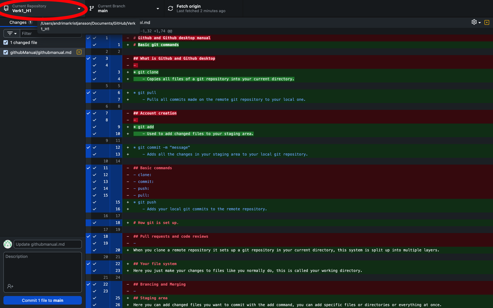
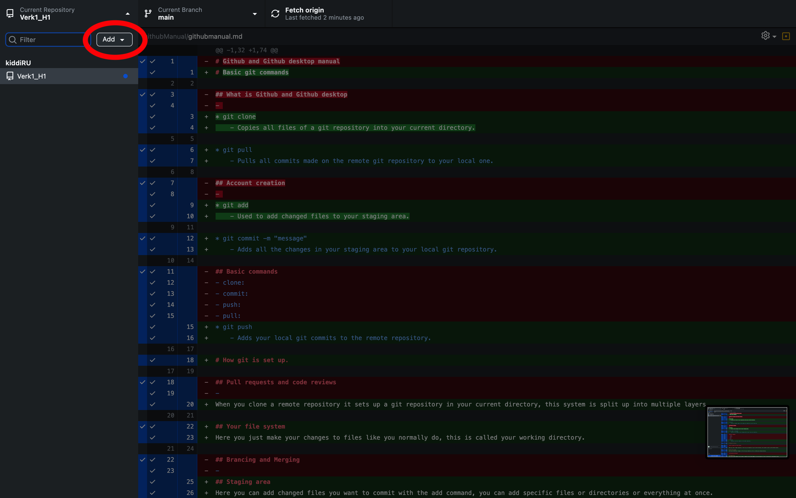
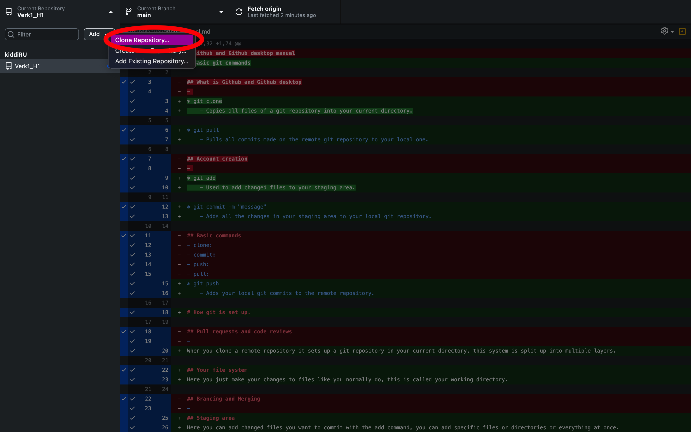
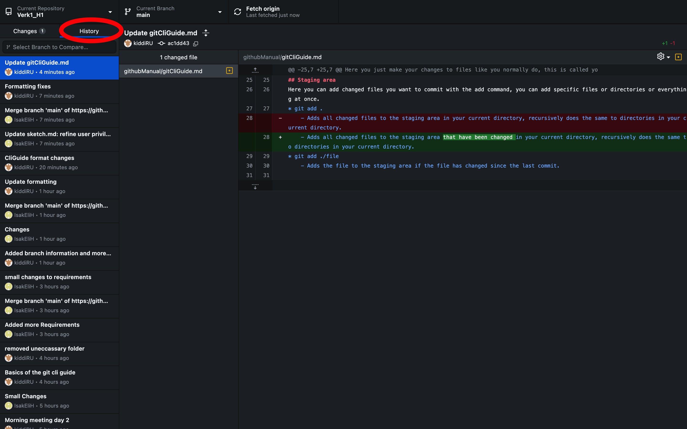
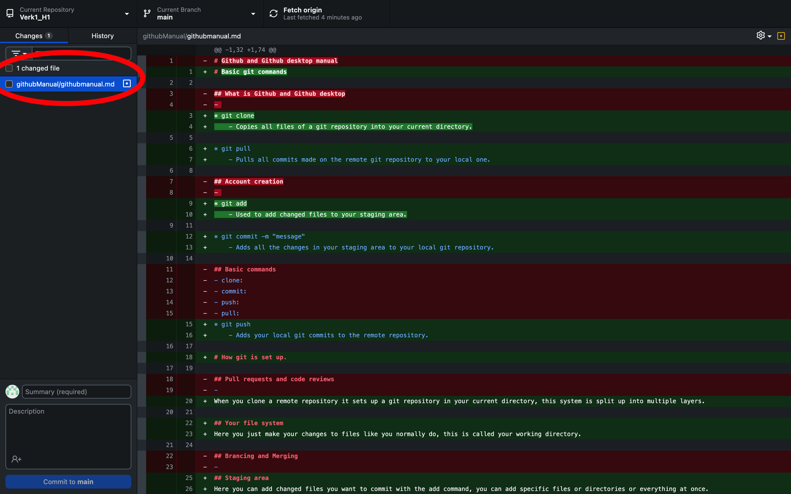
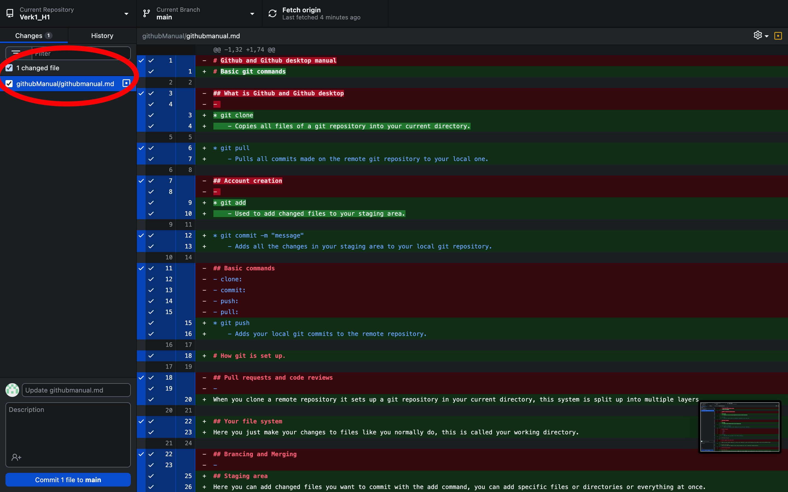
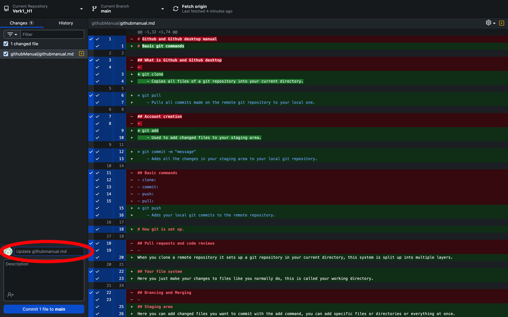
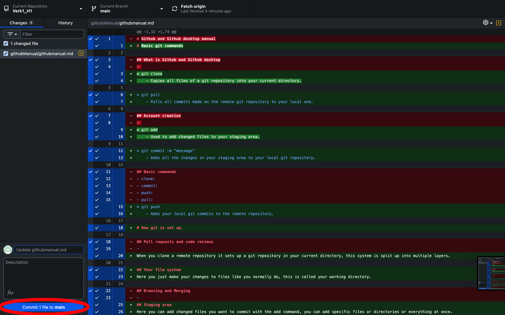
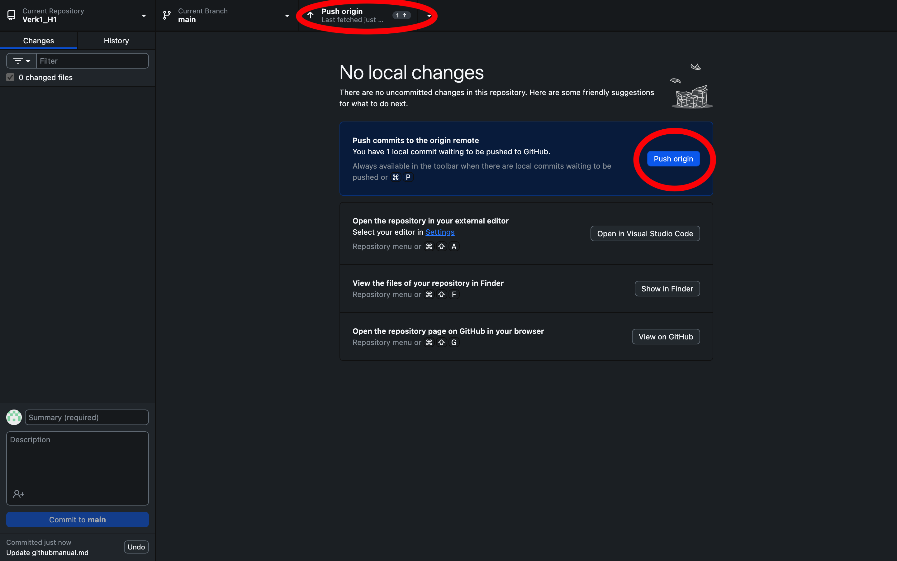

# Basic git commands

* git clone
    - Copies all files of a git repository into your current directory.

* git pull
    - Pulls all commits made on the remote git repository to your local one.

* git add
    - Used to add changed files to your staging area.

* git commit -m "message"
    - Adds all the changes in your staging area to your local git repository.

* git push
    - Adds your local git commits to the remote repository.

## How these commands are executed with github desktop

* git clone

* git pull

* git add

* git commit -m "message"

* git push

# How git is set up.

When you clone a remote repository it sets up a git repository in your current directory, this system is split up into multiple layers.

## Your file system
Here you just make your changes to files like you normally do, this is called your working directory.

## Staging area
Here you can add changed files you want to commit with the add command, you can add specific files or directories or everything at once.
- git add . | Adds all changed files to the staging area in your current directory, recursively does the same to directories in your current directory.
- git add ./file | Adds the file to the staging area if the file has changed since the last commit.
- git status

## Local git repository
The git repository is just a collection of commits you have done, when you run git commit, all the changed files stored in the staging area get added
to a commit and the git repository keeps track of the commits so you can view or revert to them giving you good control of your past changes.

## Remote git repository
This is exactly the same as your local git repository but everyone in your group project has access to it, if you have made a commit on your local git
repository, no one can see it until you run git push which pushes all commits made on your local git repository to the remote one.

# Useful commands

* git status
    - Will show you which files have changed since last commit and whether they have been added to the staging area or not

* git diff
    - Shows which files are different from your working directory and staging area.

# Branches

Branches are workspaces which are independant from other branches, the default branch is the main branch, the final product should be all on the main branch.

When working on new features you should be creating a branch for that feature and developing it on that branch, when testing is done you should move the
changes to the main branch, this let's you work on changes for a certain feature which could break it's functionality temporarily while letting other people
work on other features which rely on that feature.

You shouldn't keep branches to long or you should rebase regularly to prevent coding against old implementations.

* git branch
    - Shows you a list of available branches and highlights your current branch.

* git branch [name]
    - This let's you create a branch with a certain name, this branch is only available on your local git repository.

* git checkout [name]
    - This let's you switch branches, all differences in files between those branches get changed on your working directory automatically.

* git merge [name]
    - This let's you merge all changes on the branch [name] to your current branch.

* git rebase [name]
    - This let's you move all commits made on branch [name] infront of all commits on your current branch, is recommended before merging for a cleaner commit tree.

# Merge conflicts

Please add information if you run into merge conflicts
